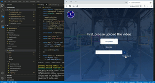

# object-detection
easy to use Object detection web application made for everyone.

## Description
a web application that detects objects the user chooses from a video and return the list of seconds the contain these objects, this web app was made using <b>Nodejs</b> and <b>TensorflowJs</b>.

## prerequisites
you should have the following programs install on your OS. 
1-Node v `10.x`. 
2-FFMPEG. 
3-MongoDB. 

## Installation

1-open terminal or cmd type `git clone https://github.com/MohammedAhmed49/object-detection` or if you the project downloaded just extract the package. 
2-`npm install`. 
3-`npm start`

## Usage
-user has to upload a video. 
-user can upload an image that contains objects the will later be detected or directly choose required objects to detect 
## Results 
should look something like this gif  

## contributing
pull requests are Welcome and you can contact us via Email [ahmed.magdy.9611@gmail.com]() or [mohamed_ahmed4949@yahoo.com]()

~Enjoy and thanks for Reading.

